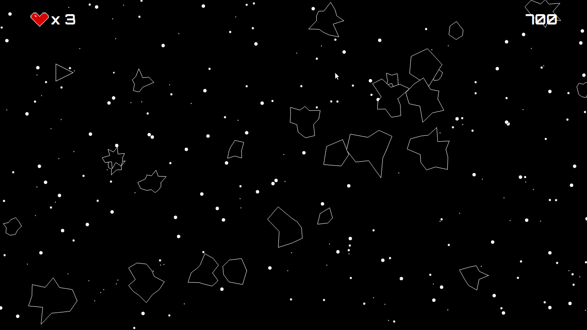

# Infinity Asteroids

### _Infinity Asteroids_ - The infinity runner game asteroids.
### Link: https://infinityasteroids.herokuapp.com/

## Built with:
- ReactJs,
- P5.js
- React-router-dom
- Styled-components
- A lot of coffee :)

## Instructions
- Open your terminal.
- Insert `git clone https://github.com/LucasAdorno/infinity-asteroids.git`
- Insert `cd infinity-asteroids`
- if you don't have nodeJS on your device, install https://nodejs.org/en/download/
- Insert the `npm i` to install all dependencies.
- Insert `npm run start` to run.

## Preview

  
  
  

